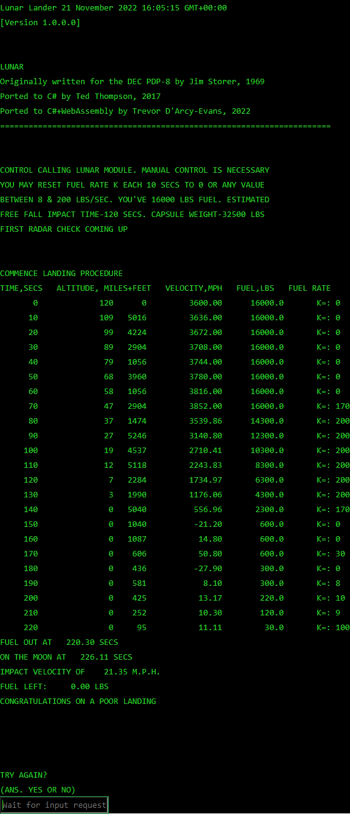

# Lunar Lander

Use your browser to land on the moon!


<details>
    <summary>Successful landing!</summary>



[Successful simulator output](https://www.cs.brandeis.edu/~storer/LunarLander/LunarLanderWebSimulator/SimulatorSampleOutputPage2.jpg)

</details>

## Background
This is a C#+Blazor+WebAssembly port of a command line [C# Lunar Lander](https://github.com/TedThompson/Lunar) which is in turn a port
of a [DEC PDP-8 Lunar Lander](https://www.cs.brandeis.edu/~storer/LunarLander/LunarLander.html).

This port uses a fork of [Blazor.Console](https://github.com/mfe-/Blazor.Console) to simulate a `Console` in a web browser.

## Prerequisites

* .NET Core 6

## Getting started

```bash
git clone https://github.com/TrevorDArcyEvans/LunarLander.WebAssembly.git --recursive
cd LunarLander.WebAssembly
dotnet restore
dotnet build
dotnet run
```

open [LunarLander.WebAssembly](https://localhost:7062/)

## Limitations
* *lots* of `Console` APIs are not supported in a browser eg
  * ForegroundColor
  * BackgroundColor
  * Title
  * WindowWidth

## Other implementations

More graphical implementations can be found here:

* http://moonlander.seb.ly/
* https://github.com/sebleedelisle/apollolander/find/master

## Further information
* [Lunar Lander video game (Wikipedia)](https://en.wikipedia.org/wiki/Lunar_Lander_(video_game_genre))
